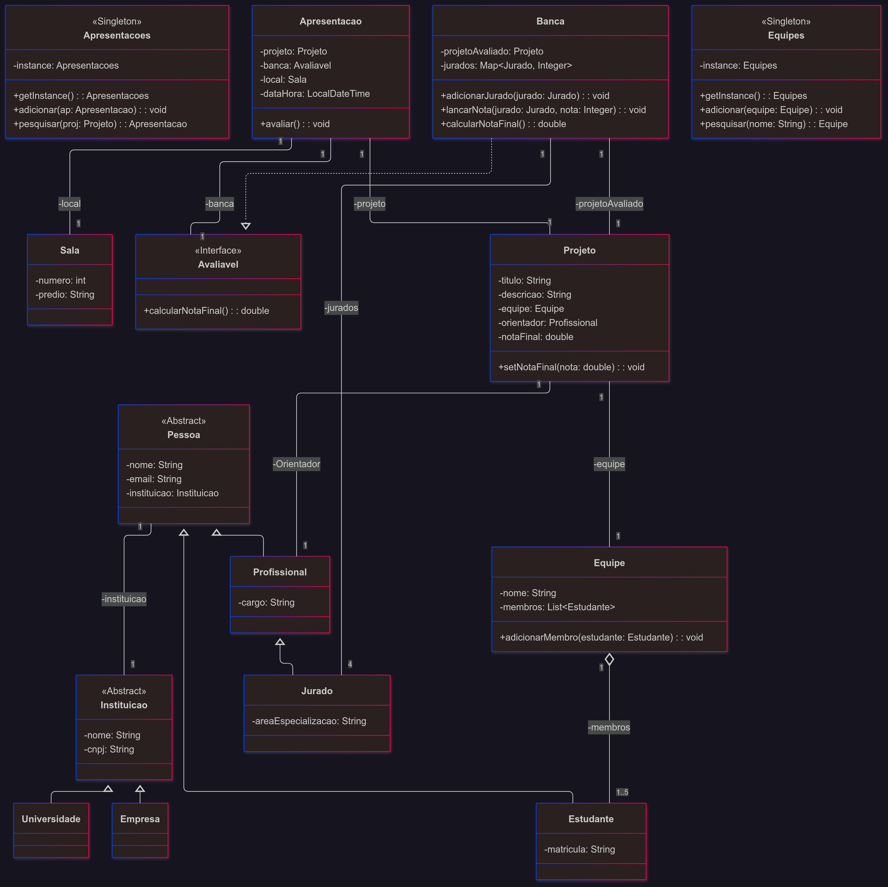

<div align="center">

# 💻 Sistema de Gerenciamento de Hackathons Universitários

<p>
  Um projeto em Java para simular a gestão de equipes, projetos e avaliações em um hackathon, desenvolvido para a disciplina de Programação Modular.
</p>


</div>

---

## 👥 Participantes e Professor

* **Professor:** Daniel Kansaon
* **Alunos:**
    * Francisco Rafael P. Rodrigues
    * João R. Fiuza

### 📖 Índice

* [Objetivo do Projeto](#-objetivo-do-projeto)
* [Arquitetura e Design](#️-arquitetura-e-design)
* [Funcionalidades e Cenário de Teste](#️-funcionalidades-e-cenário-de-teste)
* [Guia de Execução](#-guia-de-execução)
* [Participantes e Professor](#-participantes-e-professor)

---

## 🎯 Objetivo do Projeto

O objetivo deste projeto é aplicar os conceitos de **Programação Modular e Orientação a Objetos** para construir um sistema de gerenciamento de um Hackathon Universitário. [cite_start]A aplicação se concentra na administração das **equipes** e seus respectivos **projetos**, gerenciando todo o ciclo de vida desde a formação dos grupos até a avaliação final. [cite_start]O sistema foi projetado para operar inteiramente em memória principal.

---

## 🛠️ Arquitetura e Design

A arquitetura foi concebida utilizando **Java**, com base em um diagrama de classes UML pré-definido, para garantir uma estrutura coesa e extensível.

* **Estrutura de Classes:** O código foi organizado em pacotes que separam as entidades do domínio (`Pessoa`, `Equipe`, `Projeto`), a lógica de controle e a simulação principal. [cite_start]A hierarquia de classes, como `Pessoa` sendo a base para `Estudante` e `Profissional`, permite o reaproveitamento de código e a representação fiel das relações do mundo real.

* **Padrão de Projeto Singleton:** Para garantir um ponto de acesso único e controlado às coleções de dados, as classes `Equipes` e `Apresentacoes` foram implementadas seguindo o padrão **Singleton**. Essa abordagem previne a duplicação de estado e assegura a consistência dos dados em toda a aplicação.

* **Interface `Avaliavel`:** A criação da interface `Avaliavel` desacopla a lógica de apresentação da lógica de avaliação. Isso significa que a classe `Apresentacao` não precisa conhecer a implementação específica da `Banca`, tornando o sistema mais flexível e fácil de manter.

---

## ⚙️ Funcionalidades e Cenário de Teste

A classe `Main` executa uma simulação completa para demonstrar as funcionalidades do sistema, seguindo os critérios da atividade:

* **Criação de Equipes:** São criadas 2 equipes, cada uma com 5 alunos.
* **Submissão de Projetos:** Um projeto diferente é associado a cada equipe.
* **Formação de Banca:** É montada uma banca avaliadora com 4 jurados para cada projeto.
* **Cálculo da Média:** A nota final de cada projeto é calculada com base na média das notas atribuídas pelos jurados.
* **Listagem de Aprovados:** Ao final, o sistema utiliza `stream` para filtrar e exibir apenas os projetos com nota final $\ge7$.

---


## 📋 Diagrama de entidade e relacionamento 


## 🏗️ Arquitetura e Diagrama de Classes

O diagrama de classes abaixo representa a arquitetura do Sistema de Gerenciamento de Hackathons. Ele foi modelado para refletir as entidades, seus relacionamentos e as principais funcionalidades do projeto, servindo como a base para toda a implementação em Java.

*Insira a imagem do seu diagrama aqui, se desejar:*
``

### Detalhamento da Estrutura

A arquitetura do sistema é dividida em três grupos lógicos principais:

#### 1. Entidades e Atores
Este grupo define as classes base e os diferentes tipos de pessoas envolvidas no hackathon, utilizando **herança** para criar uma estrutura clara e extensível.

* **`Instituicao`** (Abstrata): Classe base que representa uma organização, como uma `Universidade` ou `Empresa`.
* **`Pessoa`** (Abstrata): Generalização para um indivíduo no sistema, contendo dados comuns como nome e e-mail, e associada a uma `Instituicao`.
* **`Estudante`**: Um participante do hackathon que compõe uma `Equipe`.
* **`Profissional`**: Pode atuar como `Orientador` de um projeto ou como `Jurado`.
* **`Jurado`**: Especialização de `Profissional`, responsável por avaliar os projetos em uma `Banca`.

#### 2. Componentes do Hackathon
Este grupo representa as entidades centrais que compõem o evento.

* **`Equipe`**: Um grupo de `Estudante`s que trabalha em um `Projeto`.
* **`Projeto`**: O trabalho desenvolvido pela `Equipe`, que possui um `Orientador` e recebe uma `notaFinal`.
* **`Banca`**: O comitê de `Jurado`s responsável por avaliar um `projetoAvaliado`.
* **`Apresentacao`**: O evento de avaliação em si, que conecta um `Projeto`, uma `Banca` e um `local` (`Sala`) em uma data e hora específicas.
* **`Sala`**: O local físico onde a apresentação ocorre.

#### 3. Padrões de Design e Interfaces
Este grupo destaca as decisões de arquitetura que garantem a flexibilidade e a organização do código.

* **`Avaliavel`** (Interface): Define um contrato com o método `calcularNotaFinal()`. A classe `Banca` implementa essa interface, o que permite desacoplar a lógica de avaliação da apresentação.
* **`Equipes`** e **`Apresentacoes`** (Singletons): São classes de coleção que seguem o padrão de projeto **`Singleton`**. Elas garantem que exista apenas uma única instância para gerenciar todos os objetos `Equipe` e `Apresentacao` no sistema, fornecendo um ponto de acesso global e controlado.

---

## 🚀 Guia de Execução

Siga os passos abaixo para compilar e rodar o projeto localmente.

### Pré-requisitos

* **Java Development Kit (JDK)** 11 ou superior instalado e configurado.

### Passos para Execução

1.  **Clone o repositório:**
    ```bash
    git clone [URL-do-seu-repositorio]
    ```
2.  **Navegue até o diretório raiz:**
    ```bash
    cd [nome-do-diretorio-do-projeto]
    ```
3.  **Compile o código-fonte:**
    ```bash
    javac -d bin src/*.java
    ```
4.  **Execute a simulação:**
    ```bash
    java -cp bin Main
    ```
