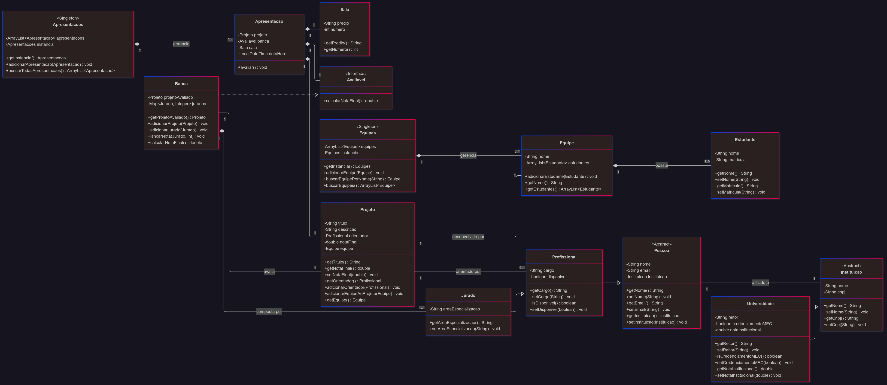

## 📘 Diagrama UML e Arquitetura do Sistema

---

## 🧠 Visão Arquitetural

O **Sistema de Gerenciamento de Hackathons Universitários** foi modelado com base em princípios sólidos de **orientação a objetos**, focando em modularidade, escalabilidade e coesão entre os componentes. Toda a lógica do sistema está representada no **diagrama de classes UML** abaixo, que ilustra a estrutura de entidades, seus relacionamentos e responsabilidades.

---

## 🧱 Componentes Arquiteturais

A estrutura do sistema está organizada em três grandes camadas lógicas:

---

### 1️⃣ Entidades e Atores do Domínio

Agrupamento de classes que representam os participantes e instituições envolvidas no hackathon.

- **`Instituicao`** *(abstrata)*: Representa uma organização de origem, como uma universidade ou empresa.
- **`Pessoa`** *(abstrata)*: Classe base para qualquer indivíduo no sistema, com atributos comuns como `nome` e `email`, vinculada a uma `Instituicao`.
  - **`Estudante`**: Participante vinculado a uma `Equipe`.
  - **`Profissional`**: Pode atuar como `Orientador` ou `Jurado`.
    - **`Jurado`**: Subclasse especializada de `Profissional`, responsável por avaliar projetos nas bancas.

> 🎓 Este grupo reflete o modelo real do evento, promovendo reutilização por meio de herança e abstração.

---

### 2️⃣ Núcleo do Hackathon

Conjunto de entidades que compõem a dinâmica funcional do evento.

- **`Equipe`**: Grupo de `Estudante`s que colabora no desenvolvimento de um `Projeto`.
- **`Projeto`**: Produto final da equipe, orientado por um `Profissional` e avaliado com uma `notaFinal`.
- **`Banca`**: Comitê formado por múltiplos `Jurado`s, encarregado da avaliação dos projetos.
- **`Apresentacao`**: Evento específico de avaliação, que relaciona um `Projeto`, uma `Banca`, uma `Sala` e um horário.
- **`Sala`**: Ambiente físico onde a apresentação ocorre.

> 🧩 Essas entidades modelam o ciclo completo de participação no hackathon, da inscrição à avaliação.

---

### 3️⃣ Padrões de Projeto e Componentes Arquiteturais

Estrutura pensada para escalabilidade e flexibilidade de código.

- **Interface `Avaliavel`**: Define o contrato de avaliação com o método `calcularNotaFinal()`. A `Banca` implementa essa interface, permitindo que diferentes entidades sejam avaliáveis de forma polimórfica.
- **Singletons: `Equipes` e `Apresentacoes`**:
  - Ambas as classes utilizam o **padrão Singleton**, garantindo uma única instância global.
  - Funcionam como gerenciadores centrais das entidades em execução, mantendo consistência e controle do estado da aplicação.

> 🛠️ Essa camada promove a **separação de responsabilidades** e reduz o acoplamento entre as partes do sistema.

---

## 📌 Considerações Finais

- O diagrama foi utilizado como **referência principal para implementação em Java**, respeitando todos os relacionamentos de herança, composição e uso.
- A arquitetura permite fácil **extensão futura**, como inclusão de fases do hackathon, novos tipos de participantes ou relatórios de desempenho.
- O uso de **interfaces e singletons** contribui diretamente para a manutenibilidade e organização do código.

---

> 💬 Se desejar o arquivo-fonte em **PlantUML**, ou gerar uma versão SVG editável, posso criar e incluir aqui com o diagrama em código.

